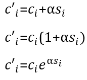

# Cox Algorithm (Frequency steganography)

## Description

This algorithm is robust to many signal processing operations. Watermark message bits
are embedded into AC DCT image coefficients with the highest energy per 1 data unit 
(8x8 pixels). Detection of an embedded digital watermark in it is performed using the
original image.

There are 3 realisations of the Cox algorithm watermark embedding:

    

where `α` is the weight coefficient (normally [0; 1]) and `s` is the bit to embed
{-1; 1}.

Current implementation is based on the **first expression**. This variant can be used
in case when the energy of the watermark is comparable to the energy of the modified 
coefficient. Otherwise, either the watermark will be non-robust, or the distortion is
too large. Therefore, it is possible to embed information with an insignificant range
of variation in values of the coefficients' energy.

## Implementation

The program is a CLI application that performs watermark embedding and extracting
procedure to/from image-container. This program is a Go module.

To build the binary, execute

`go build -o bin/cox cmd/main.go`

Or just run it w/o building the binary:

`go run cmd/main.go`

Folder with examples contains a couple of files on which program can be tested "out
of box".

### Using

To run the program in embedding mode use next example:

`<cox> -src <path/to/src.bmp> -m <binary message> -tg <path/to/tg.bmp>`

To run the program in extracting mode:

`<cox> -src <path/to/src.bmp> -ext -tg <path/to/tg.bmp>`

where\
`<cox>` is the name of the binary for particular platform\
`-src` is the flag followed by the path to source file\
`-ext` means *extract*. It is the optional flag, specified if extraction procedure is
required\
`-m` is the optional flag followed by the binary sequence (watermark) to embed. 
Specified if embedding procedure is required\
`-tg` is the flag followed by the path to target file

**For example:**\
`./cox -src ../examples/peppers.bmp -m 10101010 -tg ../examples/result.bmp`\
or\
`./cox -src ../examples/peppers.bmp -ext -tg ../examples/result.bmp`

It is also available to embed a randomly generated binary sequence using `-r` (info 
about this and other optional flags is provided with `-h` option).

### Principle of operation

**Embedding**

Program receives paths to 2 bmp-24 images: source and target (last one will be created
as a result and will contain a watermark); and the binary sequence to embed. After 
successful reading the source image, an array of blue components is selected from it.

Next, DCT is applied to the selected array; standard data unit size for DCT operation
is 8x8 block. By sequentially processing blocks, the maximum AC coefficient is 
selected from every block and then watermark current bit is embedded in it (see the 
'Theory' section below for details).

At the end, inverse DCT procedure is applied to array and image blue components are 
replaced with obtained ones. After the message embedding procedure is done, the length
of it is written into `BitMapFileHeader`: `Reserved1` and `Reserved2` fields.

Resulting image-container is saved to the provided path.

**Extracting** 

Program receives paths to 2 bmp-24 images: source and target (last one contains the 
watermark). In case of successful reading of 2 images, the length of the watermark (*N*)
is extracted from the target file header.

Next, arrays of blue component are extracted from both images, after which the DCT
operation is performed on them. Selecting the first *N* maximum AC coefficients per data
units in array from source image and comparing with the first *N* AC coefficients at the
same positions in array from target image, the watermark binary sequence is sequentially
restored (see the 'Theory' section below for details). 

The extracted watermark message is displayed on the screen.

**Skipping embedding detection**

In process of executing the program in extracting mode, the embedding detection step is
performed for the target image. On this step, the program checks the `Reserved1` and
`Reserved2` fields of `BitMapFileHeader` for the embedded message length written there 
before. If these fields are empty, the program decides, that specified target image
doesn't contain a watermark at all. But these fields can also be empty if some kind of
modifications (such as converting or compressing operations) were performed on the 
target image. 

Because of the Cox algorithm is robust, the watermark can remain in the image-container
even after applying most modification procedures. In this case, it may be necessary to
forcefully skip the embedding detection step by using `-force` flag. However, the
watermark message length will be lost and the program will compare ALL data units until 
the end of the array. So the original watermark (or what's left of it after 
modifications) is the first *N* bit of the extracted binary sequence, where *N* is the 
number that was lost.

## Theory

The basis for the Cox steganographic algorithm is the two-dimensional discrete cosine
transform (DCT).

### Watermark embedding algorithm:

1. The original image is divided into blocks of 8x8 pixels (or components) named
data units.
2. DCT is applied to each data unit, as a result of which transition from the spatial
domain to the frequency domain is performed; the obtained result is a matrix of 
coefficients *Di* (*i = 1, ... , N*; where *N* is the number of data units).
3. Data units array is formed, the watermark message will be embedded in it: there
is 1 data unit per 1 message bit.
4. The maximum modulo AC coefficient is selected in each block.
5. Depending on the current watermark message bit, according to the **first formula**
given at the beginning, the following occurs:
   - subtracting `α` from the AC coefficient, in case of `1`;
   - adding `α` to the AC coefficient, in case of `0`.
7. After all the message bits are embedded in the frequency domain of the image, the
inverse DCT is performed for each block.

### Watermark extracting algorithm:

1. Image containing the watermark, like the original one, is divided into data units.
2. DCT is applied to each block of both images: obtained results are presented in the 
form of matrices of coefficients *Di* (*i = 1, ... , N*; where *N* is the 
number of data units).
3. Two arrays of data units are formed, the second array contains a hidden message.
4. In each block of the source image array, the coordinates of maximum modulo AC 
coefficient are taken and difference between the AC coefficient in the source array
and the AC coefficient in the target array taken on the same coordinates is
calculated (the modified AC coefficient is subtracted from the original one).
5. Depending on the calculated difference, the watermark message bit is restored 
according to the following principle:
    - if the difference is positive, `1` is detected;
    - if the difference is negative, `0` is detected;
    - if the difference is zero, it is decided that the current data units are the 
   same and no watermark bit is contained in modified data unit.
6. After comparing all data units of two images, the binary sequence of the watermark 
is restored.
